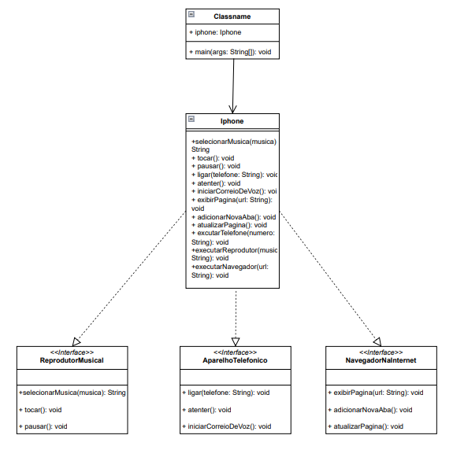

# desafio-dio-poo

Neste projeto aplico os conceitos relacionados aos pilares da da Programação Orientada a Objetos (POO) e da modelagem UML ofertados em um curso pela [DIO](https://www.dio.me/).

Aplicação consiste em representar as principais características do primeiro Iphone por meio da implentação de interfaces.

>[!IMPORTANT]
>As representações são apenas exibições de mensagens de acordo com cada método, conforme a tabela abaixo. O principal objetivo do projeto é a criação e implentação dos pilares da poo com destaque para interfaces.

| INTERFACE | MÉTODOS |
|-------------|-----------|
|Reprodutor | `tocar()` `pausar()` `selecionarMusica(String musica)` |
|Telefone | `ligar(String numero)` `atender()` `iniciarCorreioDeVoz()` |
|Navegador | `exibirPagina(String url)` `atualizarPagina()` `novaAba()` |

As interfaces são implementadas na classe `Iphone` onde crio mais três métodos `executarTelefone()`, `executarRprodutor()` e `executarNavegador()` que são responsáveis pela excução dos métodos da interface a que se refere, conforme abaixo.

```java
public void executarTelefone(String numero) {
  System.out.println("Iniciando o Telefone...");
  ligar(numero);
  atender();
  iniciarCorreioDeVoz();
  System.out.println("###############################");
}
```
## Diagrama UML


